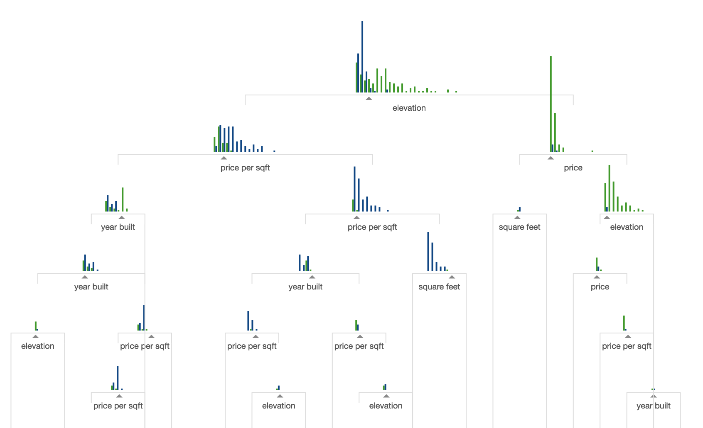

```{r message=FALSE}
library(tidyverse)
library(forcats)
library(ggrepel)
library(smodels)
library(cleanNLP)
library(glmnet)
library(Matrix)
library(xgboost)
library(stringi)
library(magrittr)

theme_set(theme_minimal())
options(dplyr.summarise.inform = FALSE)
options(width = 77L)
options(sparse.colnames = TRUE)
```

# Amazon Authorship Data: Music

As in the previous notes, I will use the extra project dataset today:

```{r, message=FALSE}
amazon <- read_csv(file.path("data", sprintf("%s.csv.gz", "cds")))
token <- read_csv(file.path("data", sprintf("%s_token.csv.gz", "cds")))
```

We will use the same design matrix from the previous notes as well:

```{r}
X <- token %>%
  cnlp_utils_tf(doc_set = amazon$doc_id,
                min_df = 0.005,
                max_df = 1,
                max_features = 200,
                token_var = "lemma")
```

It will be useful for reference later to have a sense of how well a penalized
regression model performs on this data:

```{r}
model <- cv.glmnet(
  X[amazon$train_id == "train", ],
  amazon$user_id[amazon$train_id == "train"],
  alpha = 0.9,
  family = "multinomial",
  nfolds = 3,
  trace.it = FALSE,
  relax = FALSE,
  lambda.min.ratio = 0.01,
  nlambda = 100
)

amazon %>%
  mutate(pred = as.vector(predict(model, newx = X, type = "class"))) %>%
  group_by(train_id) %>%
  summarize(class_rate = mean(user_id == pred))
```


Today we will continue our study of local models by looking at a very powerful
model based on an adaptive form of KNN.

### Decision Trees

Before we get to the main model today, we need to understand an intermediate
model called a *decision tree*. There is no good R package for running simple
decision trees for multiclass regression, so we will not actually run this
model in R. Instead, we will just discuss how the model works. I will explain
this in the case that we are predicting a continuous response variable y.

Consider a single feature (column of X) in our dataset. For some cutoff value
v, we can split the entire dataset into two parts: data less than v and data
greater than v. Within each of these haves, we could assign each observation
a prediction based on the average value of the response within each part. By
measuring how well this split of the data reduces the RMSE, we can categorize
how good a particular split is.

A decision tree starts by considering all possible split values for all of the
features. It then picks the best split and groups the data into two buckets
based on this most predictive split. Then, it recursively splits each of these
subgroups further by finding the best second splits from all possible options.
This continues until some stopping criterion is reached (minimum improvement,
maximum depth, maximum splits, etc.). The resulting model has the data split
into N buckets, with each bucket being given the average value of the training
data in each bucket.

The final form of a decision tree looks something like this:



It is an adaptive form of KNN. We use the response vector y to determine how
to group the training data into observations that are similar to one another
based on the best variables and the best cutoff values, rather than using
Euclidean distance directly.

If you want to see a longer visualization of decision trees, I suggest checking
out
[A visual introduction to machine learning](http://www.r2d3.us/visual-intro-to-machine-learning-part-1/).
It has the benefit of giving great visual intuition for the model as well as
reviewing some keep machine learning concepts.

### Gradient Boosted Trees

An individual decision tree is often not a particularly powerful model for
complex prediction tasks. A clever way to increase the predictive power of
a decision tree is to build a large collection of trees; prediction is then
done by predicting on each individual tree and averaging (or taking the
majority class) across the whole set. One such model is called a
*random forest*. The one that we will look at here is a *gradient boosted tree*,
or *gradient boosted machine* (GBM). For a continuous response, the algorithm
works like this:

- select a random subset of the training data
- build a decision tree with the selected training data to predict the response
variable
- take the predictions from this first tree, multiply by a fixed parameter
called the *learning rate* (say, 0.01), and compute the residuals for the
entire training set
- take another random subset of the training data
- building a decision tree with the selected training data to predict the
residuals from the first model
- repeat this process many times

If you prefer a mathematical description, if the fitted values from the t-th
tree are given by:

$$ \widehat{Y_i^t} $$

Then we train the k-th tree on the values Z given by:

$$ Z_i = Y_i - \eta \cdot \sum_{t = 1}^{k - 1} \widehat{Y_i^t} $$

The parameter eta is the learning rate. If set to one, this is exactly fitting
on the residuals of the prior trees. Setting to less than one stops the trees
from overfitting on the first few trees.

The details for classification tasks are a bit more complex, but the general
ideas are the same. To run gradient boosted trees, we will use the **xgboost**
package, which has a very fast implementation of a learning algorithm. It
requires us to convert our categorical `user_id` variable into an integer
starting at 0:

```{r}
author_set <- unique(amazon$user_id)
y <- (match(amazon$user_id, author_set) - 1L)
```

Then, we create training and validation sets, which are converted into an
efficient data structure by the function `xgb.DMatrix`.

```{r}
y_train <- y[amazon$train_id == "train"]
y_valid <- y[amazon$train_id == "valid"]
X_train <- X[amazon$train_id == "train",]
X_valid <- X[amazon$train_id == "valid",]

data_train <- xgb.DMatrix(data = X_train, label = y_train)
data_valid <- xgb.DMatrix(data = X_valid, label = y_valid)

watchlist <- list(train=data_train, valid=data_valid)
```

Then, we train the actual model using the `xgb.train` function. We set the
depth of the decision tree (here, 3), the learning rate (here, 0.05), and
the number of trees to build (here, 10). The number of threads is just a
computational details about how many cores to run on your machine. We also
have to indicate the number of classes (5) and tell xgboost that we are running
a multiclass prediction.

```{r}
model <- xgb.train(data = data_train,
                   max_depth = 3,
                   eta = 0.05,
                   nthread = 2,
                   nrounds = 10,
                   objective = "multi:softmax",
                   eval_metric = "mlogloss",
                   watchlist = watchlist,
                   verbose = TRUE,
                   num_class = length(author_set))
```

You can see that the function prints out the training and validation error
rates (1 minus the classification rate) after each step. We can do slightly
better by decreasing the learning rate and increasing the number of trees. I
will make sure that only some intermediate steps are printed out due to the
large number of trees with `print_every_n`.

```{r}
model <- xgb.train(data = data_train,
                   max_depth = 3,
                   eta = 0.04,
                   nthread = 2,
                   nrounds = 1500,
                   objective = "multi:softmax",
                   eval_metric = "mlogloss",
                   watchlist = watchlist,
                   verbose = TRUE,
                   print_every_n = 25,
                   num_class = length(author_set))
```

Let's see how well this model predicts the classes in our data:

```{r}
y_hat <- author_set[predict(model, newdata = X) + 1]

amazon %>%
  mutate(author_pred = y_hat) %>%
  group_by(train_id) %>%
  summarize(class_rate = mean(user_id == author_pred))
```

It manages about 89%, significantly better than before with the KNN model we
built in the previous section and slightly better even than the penalized
regression model. Another useful benefit of the gradient boosted
trees over KNN is that the former also provides variable importance scores:

```{r}
importance_matrix <- xgb.importance(model = model)
importance_matrix
```

Finally, let's create a confusion matrix for our model:

```{r}
y_hat_id <- (predict(model, newdata = X) + 1)

amazon %>%
  mutate(user_num = match(user_id, author_set)) %>%
  mutate(user_num_pred = y_hat_id) %>%
  filter(train_id == "valid") %>%
  select(y = user_num, yhat = user_num_pred) %>%
  table()
```

Here we see that on the validation set, there are no commonly confused reviewers
and that the model does fairly well across all authors.

## Thoughts on local models

We will continue to make the heaviest use of regression-based models, but
the two local models we today (particularly gradient boosted trees)
will be useful to augment these, particularly when looking at features that
benefit from determining interaction terms, such as POS N-grams. In machine
learning competitions, particularly those on non-image and non-textual data,
gradient boosted trees are very often the winning model. They can, however,
take a bit of tuning to get right. Usually this consists in slowly lowering
the learning rate and increasing the number of trees until the model
*saturates* (no longer improves).
